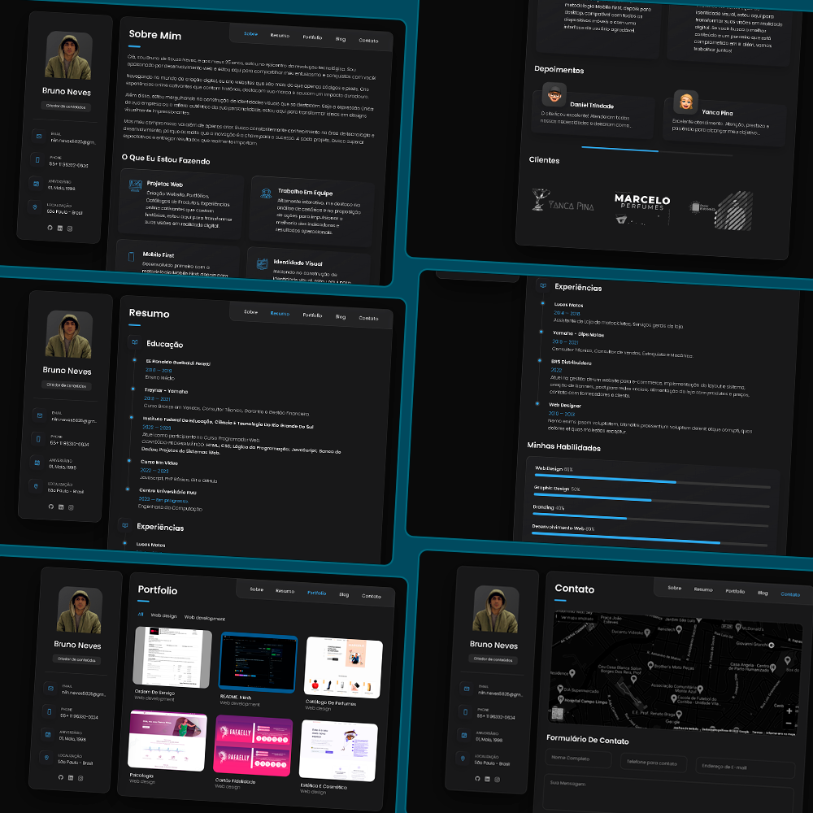
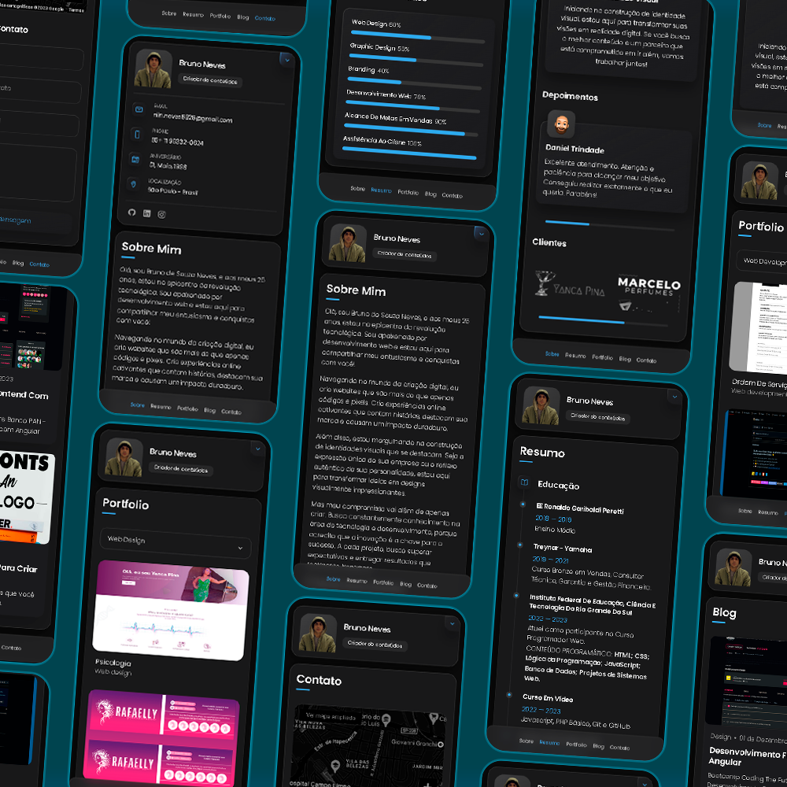

# Portfólio Pessoal
Criação de um site de portfólio pessoal totalmente responsivo para todos os dispositivos, construído usando HTML, CSS e JavaScript.

## Demonstração




## Instalando Portfólio

Para instalar o **Portfólio**, siga estas etapas:

Linux and macOS:

```bash
sudo git clone link
```

Windows:

```bash
git clone link
```

## Contato

Contato comigo via e-mail: nevesniin@gmail.com

## License

MIT